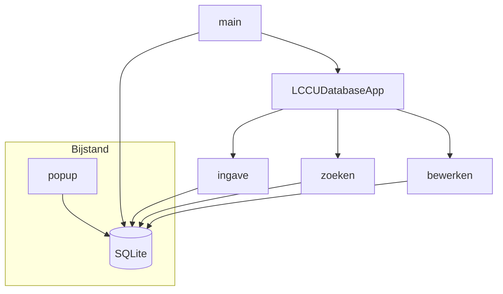

# Deel 1 – De code

## Overzicht van modules
| Module | Beschrijving |
| --- | --- |
| `config.py` | Vangt databaseconfiguratie op via environment, INI en JSON. |
| `LCCU Database.py` | Start de applicatie, creëert tabellen en bevat hulpfuncties en Tkinter-logica. |
| `views/ingave.py` | UI voor het invoeren van objecten en bijstand. |
| `views/zoeken.py` | UI voor het filteren en tonen van resultaten. |
| `views/bewerken.py` | UI voor het selecteren en bijwerken van records. |
| `views/bijstand_popup.py` | Popup voor extra bijstandsinformatie en medewerkers. |

## Architectuurdiagram

## Belangrijke functies
- `check_or_create_database()` maakt tabellen aan als ze ontbreken en normaliseert datumvelden.
- `insert_bijstand_record()` schrijft records naar `objecten` en `medewerkers_bijstand`.
- `_validate_sin()` controleert of een SIN vier letters gevolgd door vier cijfers is of `BIJSTAND`.
- `parse_date()` en `format_date()` converteren tussen Nederlands en ISO-formaat.

## Databasestructuur
### objecten
| Kolom | Type | Opmerking |
| --- | --- | --- |
| `sin` | TEXT | Unieke identificatie of `BIJSTAND`. |
| `type` | TEXT | Mobile / Computer / Bijstand. |
| `subcategorie` | TEXT | Verdere specificatie per type. |
| `dienst` | TEXT | Vaste lijst van diensten. |
| `datum_ingave` | TEXT | ISO-datumtijd. |
| `start_datum` | TEXT | Start van bijstand. |
| `eind_datum` | TEXT | Einde van bijstand. |
| ... | ... | Zie `LCCU Database.py` voor alle kolommen. |

### medewerkers_bijstand
| Kolom | Type | Opmerking |
| --- | --- | --- |
| `id` | INTEGER | Primaire sleutel. |
| `object_id` | INTEGER | Foreign key naar `objecten.id`. |
| `naam` | TEXT | Naam van de medewerker. |

## Configuratiepadlogica
`config.get_database_path()` zoekt in deze volgorde:
1. Omgevingsvariabele `LCCU_DB_PATH`
2. `config.ini` → sectie `database`, sleutel `path`
3. `config.json` → sleutel `database.path`
4. Default UNC-pad gedefinieerd in de module
