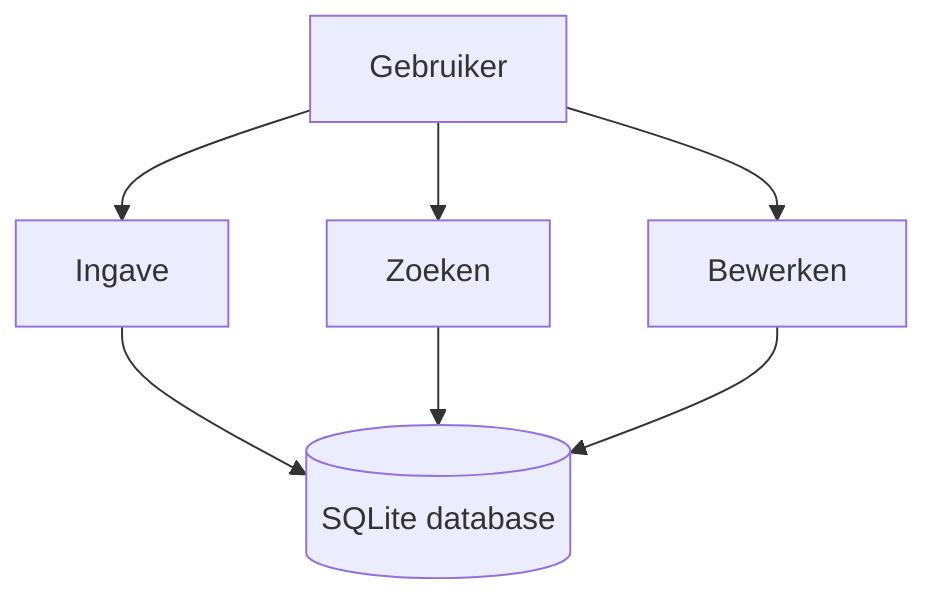

# LCCU Database Applicatie

De LCCU Database applicatie helpt bij het registreren, zoeken en bewerken van objecten en bijstandsaanvragen. Deze wiki beschrijft de installatie, werking en beheeraspecten van het project.

## Navigatie
- [Installatie en configuratie](Installatie-en-configuratie.md)
- [Deel 1 – Code](Handleiding/Deel-1-Code.md)
- [Deel 2 – Gebruik](Handleiding/Deel-2-Gebruik.md)
- [Beheer en troubleshooting](Beheer-en-troubleshooting.md)
- [Testen en kwaliteitscontrole](Testen-en-kwaliteitscontrole.md)
